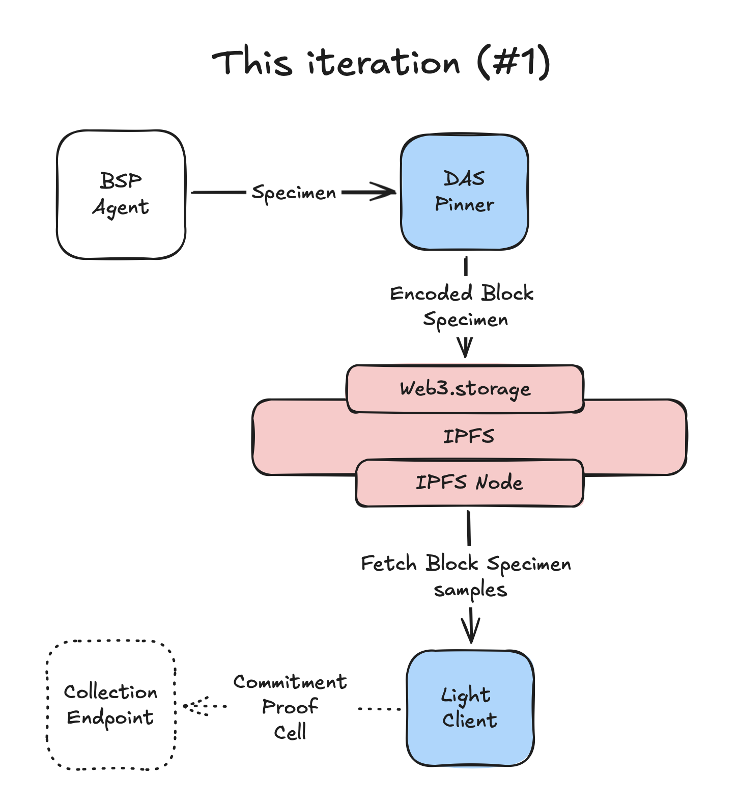

# DAS-Pinner + Light-Client

[](https://github.com/covalenthq/das-ipfs-pinner/actions)

DAS-Pinner is a lightweight IPFS pinner daemon that stores data on the IPFS network and pins the data using **web3.storage**. It is designed to be used with the DAS Light-Client to retrieve data from the IPFS network and verify the data using the DAS protocol.

## Current Iteration



## Table of Contents

- [Installation](#installation)
- [Usage](#usage)
- [Building from Source](#building-from-source)
- [Configuration](#configuration)
- [Development](#development)
- [License](#license)
- [Contributing](#contributing)

## Installation

### Light-Client

- macOS: [Installation Guide](INSTALL.md#)
- Linux: TODO: Add installation instructions

## Usage

### DAS-Pinner: Prerequisites

Before running the service, you need to install the following dependencies:

- [web3.storage](https://web3.storage/docs/go-w3up/#install-w3-cli)
- Trusted setup for the DAS-Pinner service

#### Setting up web3.storage

Create an account on [web3.storage](https://web3.storage/docs/how-to/create-account/#using-the-cli) and generate a private key:

```sh
w3 key create > private.key
```

The contents of the private key should look like this:

```sh
# did:key:z6MkhtbMWQq7dTrZXGuNMWQcFs3Wdr3E4esVbHFMX7GkiHmf
MgCbd3MtiwMFne6Fx7ta22YhWzI+lXEa4KwBQrN1WE/9V9+0BMxBp5XL6JTyn3r1P+IpZTTWBfp+800KqlpkAtCykk1Y=
```

Create permissions to add storage space (store/add) and to upload (upload/add) data:

```sh
w3 delegation create -c 'store/add' -c 'upload/add' -k <did-from-private.key> -o delegation.proof
```

#### Installing the Trusted Setup

To install the trusted setup, run the following command:

```sh
./install-trusted-setup.sh
```

### DAS-Pinner: Running the service

To start the service, use the following command:

```sh
./bin/pinner --w3-agent-key <web3.storage-agent-key:MgCbd3M...> --w3-delegation-proof-path delegation.proof
```

Output:

```sh

░▒▓███████▓▒░ ░▒▓██████▓▒░ ░▒▓███████▓▒░      ░▒▓███████▓▒░░▒▓█▓▒░▒▓███████▓▒░░▒▓███████▓▒░░▒▓████████▓▒░▒▓███████▓▒░  
░▒▓█▓▒░░▒▓█▓▒░▒▓█▓▒░░▒▓█▓▒░▒▓█▓▒░             ░▒▓█▓▒░░▒▓█▓▒░▒▓█▓▒░▒▓█▓▒░░▒▓█▓▒░▒▓█▓▒░░▒▓█▓▒░▒▓█▓▒░      ░▒▓█▓▒░░▒▓█▓▒░ 
░▒▓█▓▒░░▒▓█▓▒░▒▓█▓▒░░▒▓█▓▒░▒▓█▓▒░             ░▒▓█▓▒░░▒▓█▓▒░▒▓█▓▒░▒▓█▓▒░░▒▓█▓▒░▒▓█▓▒░░▒▓█▓▒░▒▓█▓▒░      ░▒▓█▓▒░░▒▓█▓▒░ 
░▒▓█▓▒░░▒▓█▓▒░▒▓████████▓▒░░▒▓██████▓▒░       ░▒▓███████▓▒░░▒▓█▓▒░▒▓█▓▒░░▒▓█▓▒░▒▓█▓▒░░▒▓█▓▒░▒▓██████▓▒░ ░▒▓███████▓▒░  
░▒▓█▓▒░░▒▓█▓▒░▒▓█▓▒░░▒▓█▓▒░      ░▒▓█▓▒░      ░▒▓█▓▒░      ░▒▓█▓▒░▒▓█▓▒░░▒▓█▓▒░▒▓█▓▒░░▒▓█▓▒░▒▓█▓▒░      ░▒▓█▓▒░░▒▓█▓▒░ 
░▒▓█▓▒░░▒▓█▓▒░▒▓█▓▒░░▒▓█▓▒░      ░▒▓█▓▒░      ░▒▓█▓▒░      ░▒▓█▓▒░▒▓█▓▒░░▒▓█▓▒░▒▓█▓▒░░▒▓█▓▒░▒▓█▓▒░      ░▒▓█▓▒░░▒▓█▓▒░ 
░▒▓███████▓▒░░▒▓█▓▒░░▒▓█▓▒░▒▓███████▓▒░       ░▒▓█▓▒░      ░▒▓█▓▒░▒▓█▓▒░░▒▓█▓▒░▒▓█▓▒░░▒▓█▓▒░▒▓████████▓▒░▒▓█▓▒░░▒▓█▓▒░ 
                                                                                                                       

Version: v0.1.0, commit: 00000000
Initializing root command...
2024-08-19T12:08:39.730-0700	INFO	das-pinner	pinner/main.go:47	Initializing trusted setup...
2024-08-19T12:08:41.533-0700	INFO	das-pinner	ipfs-node/w3storage.go:68	Initialized W3Storage with agent DID: did:key:z6MkfvChtMB5d5WJRGinGBWV1uuVdD6VmefLKPRU8Yog79YS
2024-08-19T12:08:41.915-0700	INFO	das-pinner	ipfs-node/w3storage.go:75	Added space with DID: did:key:z6MkiAxv94CHcwEmFxCRzrkCGq4MJDc1VC8PCCrkgA8wyAHz
generating 2048-bit RSA keypair...done
peer identity: QmY4FqTtiWZykV5D1c4vceYabSNqeh6TsFtqAndMAdcRk6
2024-08-19T12:08:43.046-0700	INFO	das-pinner	api/server.go:58	Starting server on 127.0.0.1:3001...
```

For more options, use the `--help` flag:

```sh
./bin/pinner --help
```

### Running the CLI Tool

To interact with the pinner service, use the CLI tool:

```sh
./bin/pinner-cli upload --data <path-to-data> --addr <pinner-address>
```

### DAS Light-Client

#### LC: Prerequisites

Before running the light-client, you need to install the following dependencies:

- [ipfs](https://docs.ipfs.io/install/command-line/)

#### Running the Light-Client

To run the light-client, use the following command:

```sh
./bin/light-client --rpc-url <rpc-url> \
    --contract <contract-address> \
    --topic-id <topic-id> \
    --gcp-creds-file <gcp-creds-file> \
    --client-id <client-id> 
```

Note: Client ID is the unique identifier for the client. It can be any string, just make sure it is unique.

```sh
./bin/light-client --rpc-url wss://moonbeam.blastapi.io/618fd77b-a090-457b-b08a-373398006a5e --contract 0x4932bDc983e5146224b9C2e68cfFBFEb004A2824 --topic-id DAS-TO-BQ --gcp-creds-file gcp-creds.json --client-id ${CLIENT_ID}
```

## Building from Source

### Prerequisites

- Go 1.22 or later

### Build Commands

1. Clone the repository:

```sh
git clone https://github.com/covalenthq/das-ipfs-pinner
cd das-ipfs-pinner
```

2. Install dependencies:

```sh
make deps
```

3. Build binaries:

```sh
make
```

This will compile the daemon and CLI tool into the bin directory.

### Clean Up

To clean up the build artifacts, run:

```sh
make clean
```

## Configuration

The project uses environment variables and flags for configuration. For example, you can set `DAEMON_ADDR` to change the address the daemon listens on.

## Development

### Formatting and Linting

To format the code, run:

```sh
make fmt
```

To lint the code, run:

```sh
make vet
make staticcheck
```

### Testing

To run tests, use the following command:

```sh
make test
```

To run tests with a coverage report:

```sh
make test-cover
```

## License

This project is licensed under the MIT License. See the [LICENSE](LICENSE) file for details.


## Contributing

TODO: Add contribution guidelines