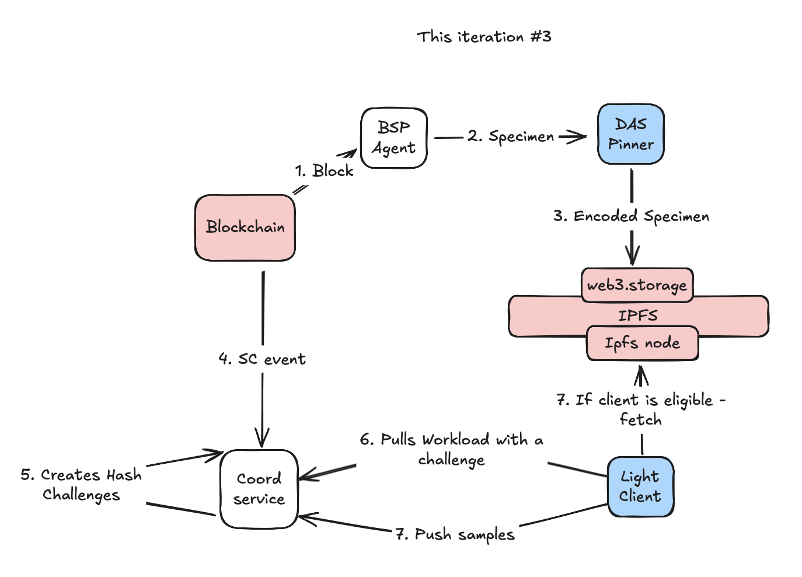
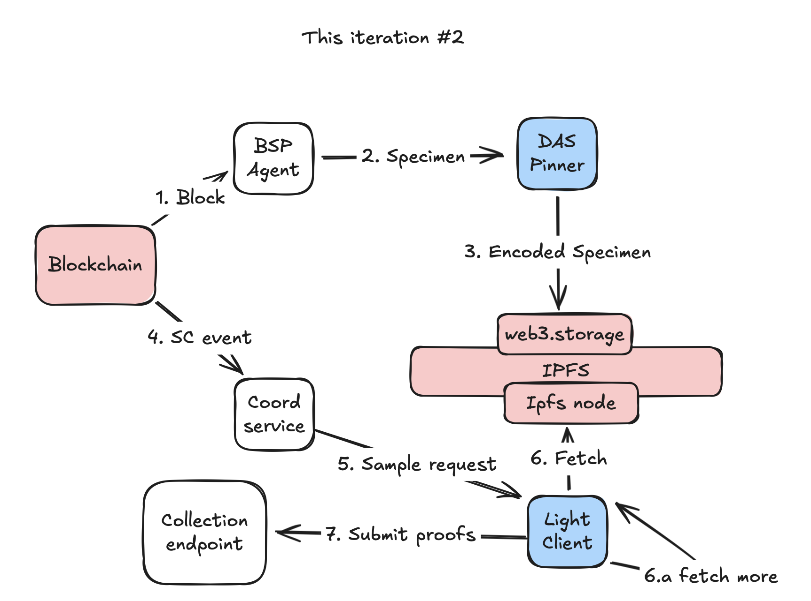

# DAS-Pinner + Light-Client

[](https://github.com/covalenthq/das-ipfs-pinner/actions)

**DAS-Pinner** is a lightweight IPFS service that stores and pins data on the IPFS network using **web3.storage**. It is designed to work seamlessly with the DAS Light-Client, enabling the retrieval of data from the IPFS network and its verification using the DAS protocol.

**DAS Light-Client** is a lightweight client that retrieves data from the IPFS network and verifies it using the DAS protocol. It is intended to complement the DAS-Pinner service, facilitating efficient data storage and retrieval from the IPFS network.

## Current Iteration



### Previous Iteration

<a href="assets/iteration1.png">
    
    
</a>

## Table of Contents

- [Building from Source](#building-from-source)
  - [Prerequisites](#prerequisites)
  - [Build Commands](#build-commands)
  - [Clean Up](#clean-up)
- [Running the Service](#running-the-service)
  - [Light-Client](#light-client)
  - [DAS Pinner](#das-pinner)
- [Development](#development)
- [TODO](#todo)
- [License](#license)
- [Contributing](#contributing)

## Building from Source

### Prerequisites

- Go 1.22 or later

### Build Commands

Clone the repository:

```sh
git clone https://github.com/covalenthq/ewm-das
cd ewm-das
```

Install dependencies:

```sh
make deps
```

Build binaries:

```sh
make
```

Note: To build das-pinner with experimental features (stacking erasure coded cells together), run:
  
```sh
make build-pinner EXTRA_TAGS="-tags experimental"
```

The binaries will be built in the `bin` directory.

### Clean Up

To clean up the build artifacts, run:

```sh
make clean
```

## Running the Service

### Light-Client

- Source: [Guide](LIGHTCLIENT.md#running-light-client-locally)
- Docker: [Guide](LIGHTCLIENT.md#running-light-client-in-docker)
- macOS: [Guide](INSTALL.md#)
- Linux: TODO

### DAS-Pinner

- Source: [Guide](PINNER.md#)

## Development

### Formatting and Linting

To format the code, run:

```sh
make fmt
```

To lint the code, run:

```sh
make vet
make staticcheck
```

Note: The `staticcheck` command requires the `staticcheck` binary to be installed. For more information, see the [staticcheck](https://staticcheck.dev/docs/getting-started/) documentation.

### Testing

To run tests, use the following command:

```sh
make test
```

To run tests with a coverage report:

```sh
make test-cover
```

## TODO

### TESTNET

- [x] LC workload management - verify only 1 validated (post consensus) block specimen cid per block height
- [x] DAS-pinner parity development to replace ipfs-pinner
- [x] Packaging and installation improvements
- [x] Workload distribution system v1
- [x] Authorization layer for LC proof submission v1 (PoA)
- [ ] Guarantee LCs perform minimum sampling for availability
- [ ] Collection-Reward distribution system v1

## License

This project is licensed under the Apache License 2.0. See the [LICENSE](LICENSE) file for details.


## Contributing

TODO: Add contribution guidelines
